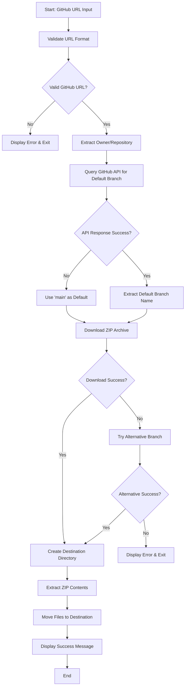
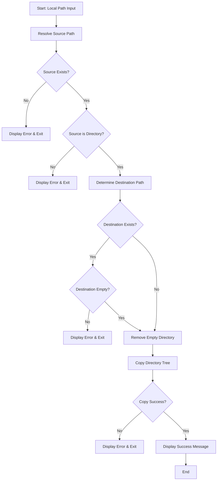
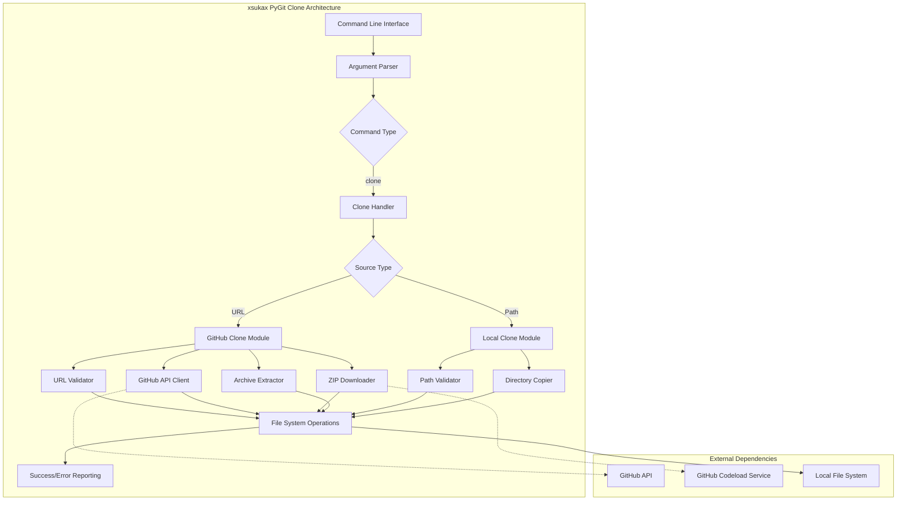

# xsukax PyGit Clone

[](https://www.python.org/downloads/)
[](https://www.gnu.org/licenses/gpl-3.0)
[](https://github.com/xsukax/xsukax-pygit-clone)

A lightweight, cross-platform Git clone utility implemented in pure Python that operates without requiring Git installation on the target system. This tool provides essential repository cloning functionality while maintaining simplicity and broad compatibility across different operating systems.

## Project Overview

xsukax PyGit Clone is a standalone Python application designed to replicate core Git cloning functionality without external dependencies. The tool addresses the common scenario where users need to clone repositories on systems where Git is not installed or where installation restrictions exist.

The application supports two primary cloning methods:
- **Remote cloning** from GitHub repositories via HTTPS URLs, utilizing GitHub's codeload service to download repository snapshots
- **Local cloning** through filesystem operations that preserve directory structures and Git metadata when present

This solution is particularly valuable in restricted environments, containerized applications, CI/CD pipelines with minimal base images, and educational contexts where Git installation complexity needs to be avoided.

## Security and Privacy Benefits

### Data Protection Measures

**Secure Communication Protocol**
- All remote communications utilize HTTPS encryption, ensuring data integrity and confidentiality during repository downloads
- Custom User-Agent headers prevent tracking while maintaining compatibility with GitHub's API requirements

**Input Validation and Sanitization**
- Comprehensive URL validation prevents malicious redirect attacks and ensures only legitimate GitHub repositories are accessed
- Path traversal protection through Python's `pathlib.Path.resolve()` prevents directory escape attacks
- Robust error handling prevents information disclosure through detailed error messages

**Minimal Network Exposure**
- Direct API calls to GitHub's official endpoints reduce third-party dependency risks
- Limited network surface area with timeout controls prevent hanging connections and potential DoS vulnerabilities
- No persistent connections or session management reduces attack vectors

### Privacy-Enhancing Features

**No Telemetry or Analytics**
- Zero data collection or transmission of usage statistics
- No external analytics services or tracking mechanisms
- Complete offline operation capability for local repository cloning

**Minimal Footprint**
- Self-contained operation without creating system-wide configurations
- Temporary file cleanup ensures no residual data remains after operations
- No registry modifications or system-level changes required

## Features and Advantages

### Core Capabilities

**Universal Platform Support**
- Native compatibility with Windows, Linux, and macOS without modification
- No architecture-specific dependencies or compiled components
- Consistent behavior across different Python interpreter implementations

**Zero External Dependencies**
- Operates using only Python standard library components
- Eliminates security risks associated with third-party package vulnerabilities
- Simplifies deployment and reduces maintenance overhead

**Intelligent Repository Handling**
- Automatic detection of default branch through GitHub API integration
- Fallback mechanisms for common branch naming conventions (main/master)
- Preservation of directory structures and file permissions during local cloning

### Advanced Features

**Robust Error Recovery**
- Graceful degradation when API rate limits are encountered
- Automatic retry mechanisms with alternative branch detection
- Comprehensive error reporting with actionable user guidance

**Flexible Destination Management**
- Automatic repository name extraction from URLs
- Custom destination directory specification
- Conflict prevention through pre-flight directory validation

## Installation Instructions

### Prerequisites

Ensure Python 3.7 or higher is installed on your system. Verify installation with:

```bash
python --version
# or
python3 --version
```

### Installation Methods

#### Method 1: Direct Download

1. Download the `xsukax-pygit.py` file to your desired directory
2. Make the file executable (Unix-like systems):
   ```bash
   chmod +x xsukax-pygit.py
   ```

#### Method 2: Clone and Setup

```bash
# Clone this repository
git clone https://github.com/xsukax/xsukax-PyGit-Clone.git
cd xsukax-PyGit-Clone

# Make executable (Unix-like systems)
chmod +x xsukax-pygit.py

# Create symbolic link for global access (optional)
ln -s $(pwd)/xsukax-pygit.py /usr/local/bin/xsukax-pygit
```

#### Method 3: Windows Setup

1. Download `xsukax-pygit.py` to a directory in your PATH
2. Create a batch file wrapper (optional):
   ```batch
   @echo off
   python "%~dp0xsukax-pygit.py" %*
   ```

### Verification

Verify installation by running:
```bash
python xsukax-pygit.py --help
```

## Usage Guide

### Command Structure

The application follows a standard command-line interface pattern with subcommands:

```bash
python xsukax-pygit.py <command> <arguments>
```

### Basic Operations

#### Cloning GitHub Repositories

**Standard Repository Clone**
```bash
python xsukax-pygit.py clone https://github.com/xsukax/xsukax-PyGit-Clone.git
```

**Clone to Specific Directory**
```bash
python xsukax-pygit.py clone https://github.com/xsukax/xsukax-PyGit-Clone.git my-project
```

**Clone Repository Without .git Extension**
```bash
python xsukax-pygit.py clone https://github.com/xsukax/xsukax-PyGit-Clone
```

#### Local Directory Cloning

**Basic Local Clone**
```bash
python xsukax-pygit.py clone /path/to/source/directory
```

**Local Clone with Custom Destination**
```bash
python xsukax-pygit.py clone /path/to/source/directory backup-copy
```

### Process Flow Diagrams

#### GitHub Repository Cloning Workflow



#### Local Directory Cloning Workflow



### Advanced Usage Examples

#### Batch Repository Cloning

Create a shell script for multiple repository cloning:

```bash
#!/bin/bash
# batch-clone.sh

repositories=(
    "https://github.com/user/repo1.git"
    "https://github.com/user/repo2.git"
    "https://github.com/user/repo3.git"
)

for repo in "${repositories[@]}"; do
    echo "Cloning $repo..."
    python xsukax-pygit.py clone "$repo"
done
```

### Troubleshooting Common Issues

#### Network Connectivity Problems
- Ensure stable internet connection for GitHub operations
- Check firewall settings for HTTPS traffic
- Verify GitHub service status if API calls fail

#### Permission Issues
- Ensure write permissions for destination directory
- Run with appropriate user privileges for system-wide installations
- Check file system permissions on Unix-like systems

#### Python Environment Issues
- Verify Python version compatibility (3.7+ required)
- Ensure standard library modules are available
- Check Python path configuration in system environments

## System Architecture

### Component Overview



## Contributing

Contributions to xsukax PyGit Clone are welcome. Please ensure all contributions align with the project's security and privacy principles:

1. Maintain zero external dependencies
2. Preserve cross-platform compatibility
3. Include comprehensive error handling
4. Follow security best practices for input validation
5. Maintain code clarity and documentation standards

## Support and Maintenance

This project is actively maintained. For support:
- Create issues for bugs or feature requests
- Provide detailed system information for troubleshooting
- Include error messages and steps to reproduce issues

## Licensing Information

This project is licensed under the **GNU General Public License v3.0**.

The GPL v3.0 license ensures that:
- Users have the freedom to run, study, share, and modify the software
- Any modifications or derivative works must also be released under GPL v3.0
- Source code must remain available to all users
- Commercial use is permitted while maintaining copyleft requirements

For the complete license text, please refer to the [LICENSE](LICENSE) file included with this distribution or visit [https://www.gnu.org/licenses/gpl-3.0.html](https://www.gnu.org/licenses/gpl-3.0.html).

### License Compliance

When using or distributing this software:
- Include the original license notice in all copies or substantial portions
- Clearly indicate any modifications made to the original code
- Provide access to the complete source code for any distributed versions
- Ensure derivative works comply with GPL v3.0 requirements

---

This software is provided "as is" without warranty of any kind, express or implied, including but not limited to the warranties of merchantability, fitness for a particular purpose, and non-infringement.
